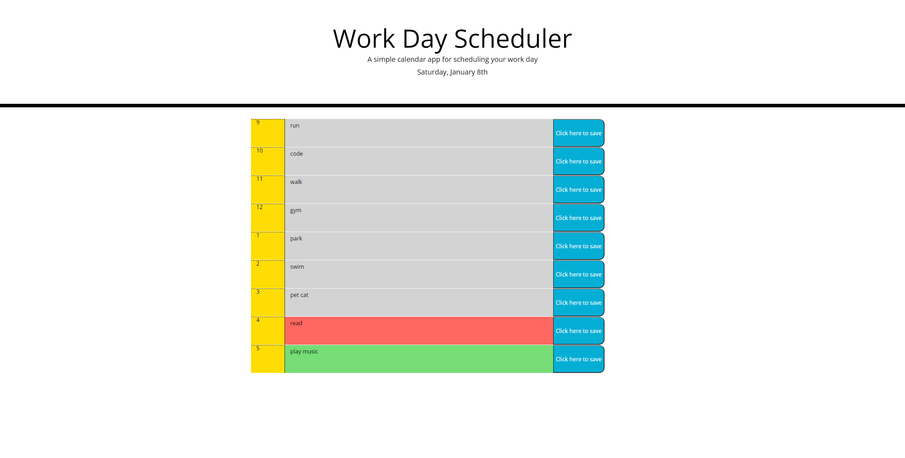

# HW5-Daily-Planner

For this project, I created logic for a dynamic day planner using JavaScript, HTML, and CSS. 

#Purpose
This project gave me experience with using JavaScript, HTML, and CSS to create a functioning application.

#Usage
To view my project (and take the quiz) simply click the attached link and you'll be able to see the deployed project.
https://github.com/fvjr/HW5-Daily-Planner

Link:[Live URL](https://github.com/fvjr/HW5-Daily-Planner/settings/pages/source)

Also, here's my code for the project in my Git repository:
https://fvjr.github.io/HW5-Daily-Planner/

#Contributing 
To access the code, access my GitHub repo titled "HW5-Daily-Planner". My GitHub repo is linked above. If you have any ideas of how to simplify or improve some code, please feel free to reach out! I'll continue to improve the project as I have time to work on it.

#Credits 
Assistance provided by Penn LPS Coding Boot Camp/Trilogy Education Services. Websites I used for assistance: https://developer.mozilla.org/en-US/docs/Web/JavaScript/Reference

#Resources
1.) https://getbootstrap.com/docs/5.1/getting-started/introduction/
2.) https://momentjs.com/
3.) https://www.w3schools.com/js/default.asp
4.) https://developer.mozilla.org/en-US/docs/Web/JavaScript

